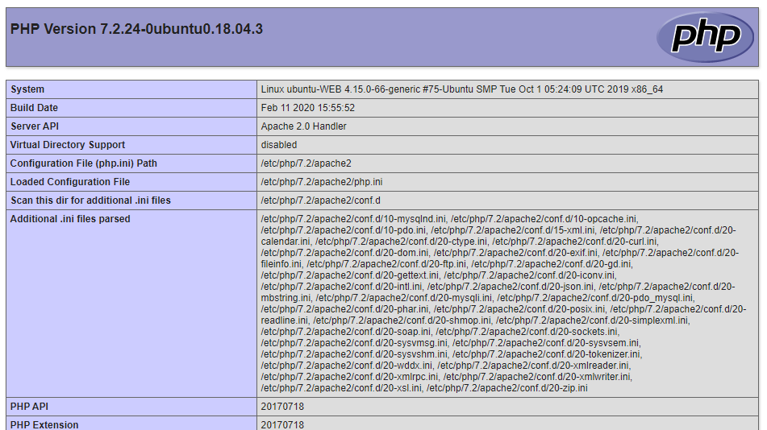
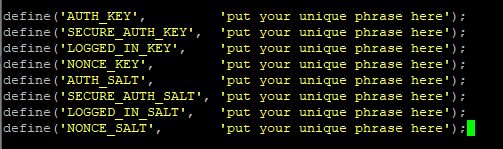
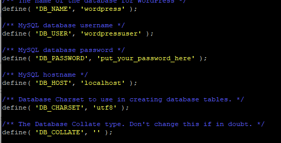
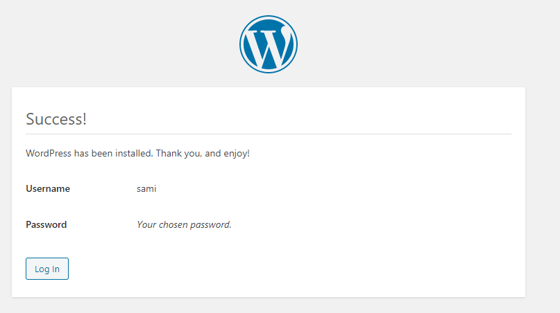
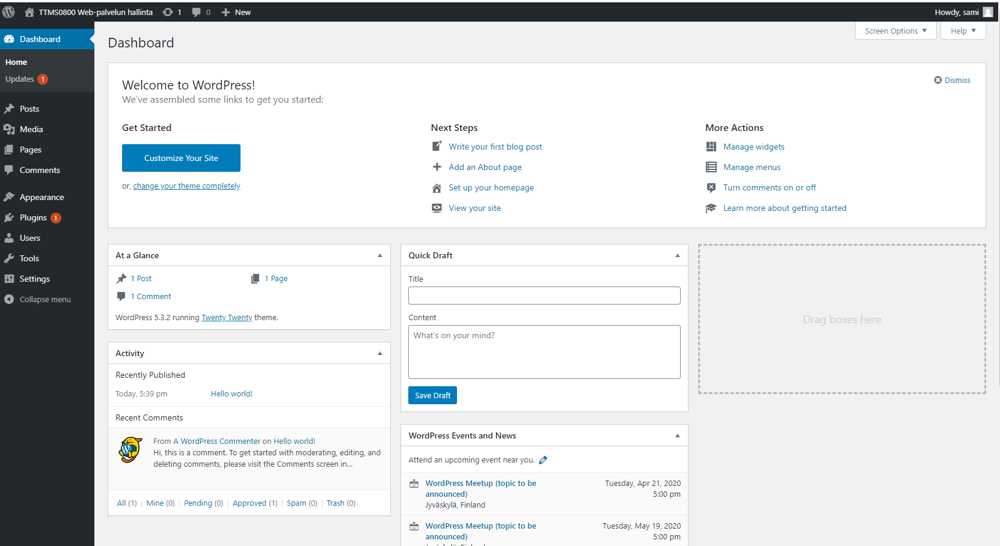

WordPress CMS julkaisujärjestelmä ja WooCommerce lisäosa  
========================================================
Asennus Ubuntu 18.04 käyttöjärjestelmään
----------------------------------------
Sami Luoma-aho, N4939  
19.3.2020  
TTMS0800 Web-palvelun hallinta harjoitustyö  

[1. Johdanto](#1-johdanto)  
[2. Esivalmistelut](#2-esivalmistelut)  
- [2.1. LAMP](#21-lamp)  
- [2.2. PHP](#22-php)  
- [2.3. MariaDB](#23-mariadb)  

[3. WordPress CMS asennus](#3-wordpress-cms-asennus)  
[4. WooCommerce asennnus](#4-woocommerce-asennnus)  
[5. Johtopäätökset](#5-johtopäätökset)  

# 1. Johdanto  
Harjoitustyössä luodaan täysin toimiva WordPress CMS alusta WooCommerce -kauppapaikkalaajennoksella Ubuntu 18.04 server käyttöjärjestelmään. Harjoitustyö tehdään Digital Ocean droplettiin, joka toimii harjoitustyön ajan osoitteessa 134.122.85.70.  

# 2. Esivalmistelut

Luodaan aluksi uusi käyttäjä, jolle annetaan sudo oikeudet. 
>\$ sudo useradd -m -s /bin/bash *your_user*
>\$ usermod -aG sudo *your_user*

Lisäksi asetetaan uudelle käyttäjälle salasana, jonka jälkeen siirrytään käyttämään luotua käyttäjää. Tästä eteenpäin kaikki komennot tehdään luodulla käyttäjällä.
>\$ passwd *your_user*
>\$ su *your_user*

Aivan aluksi päivitetään aptitude kirjasto ja järjestelmä. Tällöin käytämme asennuksissa varmasti viimeisimpiä ohjelmistoja.
>\$ sudo apt update  
>\$ sudo apt upgrade  

## 2.1. Apache
>\$ sudo apt install apache2

Apachen asennuksen jälkeen asetetaan UFW-työkalulla palomuuriin sopivat asetukset Apachea varten. UFW:ssä on valmiiksi joitain profiileita eri sovelluksia varten. Valmiit profiilit voi listata komennolla: 
>\$ sudo ufw app list

>*Available applications:
&nbsp;&nbsp;&nbsp; Apache  
&nbsp;&nbsp;&nbsp; Apache Full
&nbsp;&nbsp;&nbsp; Apache Secure
&nbsp;&nbsp;&nbsp; OpenSSH*

Komennolla
>\$ sudo ufw app info "Apache Full"  

nähdään ufw:n valmiin profiilin tiedot. Tiedoista käy ilmi, että ufw:n palomuuriin sallitaan TCP-liikenne portteihin 80 ja 443. Portit ovat http ja ssh -protokollien käyttämät portit.  

Lisätään palomuuriin profiili Apache Full.  
>\$ sudo ufw allow in "Apache Full"

Seuraavaksi käynnistetään apache2 palvelu uudelleen komennolla:
>\$ systemctl restart apache2

Ja tarkistetaan, että palvelu on käynnissä komennolla
>\$ systemctl status apache2

Palvelun tilan tulisi olla "active (running)"

## 2.2. MySQL

>\$ sudo apt install mysql-server

Seuraavaksi ajetaan MySQL:ään esiasennettu scripti, jolla asetetaan tiettyjä turvaominaisuuksia tietokannalle. Ominaisuuksissa määritellään muun muassa 
- salasanan validointi, 
- anonymous käyttäjän poisto
- test database:n poisto
- root käyttäjän etäyhteyden esto
  
>\$ sudo mysql_secure_installation

Edellä mainittu tietoturvaominaisuuksien määrittely ei ole pakollinen, mutta lisää tietokannan tietoturvaa. 

Seuraavaksi asetetaan root käyttäjälle salasana MySQL:ään. Aloitetaan siirtymällä MySQL:ään. 

>\$ sudo mysql

Alla olevalla komennolla nähdään mikäli root käyttäjällä on olemassa salasana. Salasanaa ei ole mikäli sitä ei ole erikseen asetettu.

>mysql> SELECT user,authentication_string,plugin,host FROM mysql.user;

Asetetaan salasana ja asetetaan muutokset voimaan komennoilla:

>mysql> ALTER USER 'root'@'localhost' IDENTIFIED WITH mysql_native_password BY '  *your password*  ';

>mysql> FLUSH PRIVILEGES;

Halutessasi voit vielä tarkistaa, että salasana on asetettu.

WordPress tarvitsee toimiakseen oman tietokannan. Tietokannan nimellä ei ole merkitystä, mutta käytämme tässä tietokannalla nimeä "wordpress". Luodaan tietokanta Wordpressin käyttöön komennolla:

>mysql> CREATE DATABASE wordpress DEFAULT CHARACTER SET utf8 COLLATE utf8_unicode_ci;

Tietokannan luonnin jälkeen luodaan erillinen MySQL-käyttäjä, jolla on oikeudet käyttää luotua tietokantaa. Jälleen käyttäjänimi voi olla mikä tahansa, mutta käytämme tässä nimeä "wordpressuser". Komennon jälkeen asetetaan muutokset voimaan ja poistutaan mysql:stä.

>mysql> GRANT ALL ON wordpress.* TO 'wordpressuser'@'localhost' IDENTIFIED BY '  *your password*   ';

>mysql> FLUSH PRIVILEGES;

>mysql> EXIT;

## 2.3. PHP

WordPress tarvitsee toimiakseen myös PHP:n ja joitain PHP laajennuksia. Asennetaan aluksi php sekä kaksi "apupakettia", jotta php voi keskutella apachen ja mysql:n kanssa. 

>\$ sudo apt install php libapache2-mod-php php-mysql

Seuraavaksi asennetaan muutamia yleisimpiä PHP-laajennuksia Wordpressin käyttöön. Asennuksen jälkeen käynnistetään Apache uudelleen seuraavaa vaihetta varten.

>\$ sudo apt install php-curl php-gd php-mbstring php-xml php-xmlrpc php-soap php-intl php-zip

>\$ sudo systemctl restart apache2

Ennen seuraavan vaiheeseen siirtymistä kannattaa tarkistaa, että php on asentunut. Tehdään testisivu tätä varten.
>\$ sudo nano /var/www/html/info.php

Sisällöksi sivulle annetaan seuraavat rivit:
> \<?php 
phpinfo();
?>

Mikäli PHP on asentunut oikein nähdään alla oleva kuva selaimella osoitteessa:
>http://oma.ip-osoitteesi/info.php

## 2.4. Apachen lisäasetuksia
WordPress ja useat sen lisäosat käyttävät .htaccess tiedostoja kansiokohtaisiin muokkauksiin. Tämän vuoksi .htaccess tiedostojen käyttö (.htaccess override and rewrite) tulee sallia.  
Seuraavassa teemme muokkaukset sillä oletuksella, että Wordpressin juurikansio on /var/www/wordpress/.  

Luodaan wordpress.conf konfigurointitiedosto.

>\$ sudo nano /etc/apache2/sites-available/wordpress.conf

Asetetaan tiedostoon sisällöksi alla olevat rivit:

>\<Directory /var/www/wordpress/>
>&nbsp;&nbsp;&nbsp;&nbsp;&nbsp;&nbsp; AllowOverride All
>\</Directory>

Astetaan verkkosivujen juurikansioksi /var/www/wordpress/ muokkaamalla tiedostoa /etc/apache2/sites-available/000-default.conf

>\$ sudo nano /etc/apache2/sites-available/000-default.conf

Muokataan tiedostossa DocumentRoot rivi muotoon:
> DocumentRoot /var/www/wordpress/

WordPressissä on ns. permalink -ominaisuus, jolla esimerkiksi blogipostauksiin voidaan viitata muuttumattomilla linkeillä. Permalink ominaisuuden mahdollistamiseksi Rewrite -moduli voidaan aktivoida komennolla:

>\$ sudo a2enmod rewrite

Lopuksi testataan, että kaikki toimii syntaksin puolesta.  

>\$ sudo apache2ctl configtest

Komennon tuloksena saattaa tulla virhe, mutta lopuksi kuitenkin tulisi tulostua "Syntax OK". Mikäli näin on jatketaan käynnistämällä apache -palvelu uudelleen.

>\$ sudo systemctl restart apache2

# 3. WordPress CMS asennus

Aluksi luodaan väliaikainen kansio juureen. Ja haetaan wordpress.org osoitteesta viimeisin Wordpress versio. 
>\$ cd /tmp
>\$ curl -O https://wordpress.org/latest.tar.gz

Puretaan haettu tiedosto ja luodaan ns dummy .htaccess tiedosto wordpressin myöhempää käyttöä varten. 

>\$ tar xzvf latest.tar.gz
>\$ touch /tmp/wordpress/.htaccess

Haetun paketin mukana tulee myös esimerkki-konfiguraatiotiedosto, joka voidaan ottaa pohjaksi konfiguraatioillemme. Kopioidaan tiedosto nimelle, jota Wordpress lukee. 

>\$ cp /tmp/wordpress/wp-config-sample.php /tmp/wordpress/wp-config.php

Luodaan vielä käyttöoikeusongelmia silmälläpitäen upgrade-kansio, jota wordpress tarvitsee ohjelmistopäivityksissä.

>\$ mkdir /tmp/wordpress/wp-content/upgrade

Lopuksi kopioidaan kaikki tiedostot oikeaan kansioon. 

>\$ sudo cp -a /tmp/wordpress/. /var/www/wordpress

>\$ sudo chown -R www-data:www-data /var/www/wordpress

>\$ sudo find /var/www/wordpress/ -type d -exec chmod 750 {} \;

>\$ sudo find /var/www/wordpress/ -type f -exec chmod 640 {} \;

>\$ curl -s https://api.wordpress.org/secret-key/1.1/salt/

>\$ sudo nano /var/www/wordpress/wp-config.php

Seuraavaksi muokataan samassa tiedostossa alla olevia rivejä. Riveille annetaan Wordpressin käyttöön luomamme tietokannan nimi, käyttäjän nimi ja käyttäjän salasana. 

>\$

>\$

>\$

# 4. WooCommerce asennnus

# 5. Johtopäätökset

Harjoitustyön nimi, tekijöiden nimet, päivämäärä ja tieto siitä, että kyseessä on Verkkopalvelut -opintojakson harjoitustyö.
Tehtävän kuvaus / Johdanto. Esim. "Nykyiset Internetin sovellusprotollat ovat hyvin turvattomia... varsinkin e- kaupankäynnissä on välttämätöntä salata http-liikennettä... https-"protokolla" on ratkaisu; Se... ... Tässä työssä asennetaan Linux alustalle SSL-kykyinen Apache Web-palvelin"
Varsinainen aiheen käsittely. Esim. ohjelmistot käyttöesimerkkeineen
mahdollisesti asennusohjeita (Mistä URLista imuroitiin ja mitä jne..)
mahdollisesti käyttöohjeita ja käyttöesimerkkejä mahdollisine kuvaruutukauppauksineen
Johtopäätökset: "Ohjelma sopii hyvin... Vaikea asennus on Linuxiin tottumattomalle..."
Lähteet