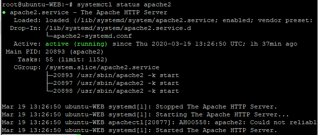
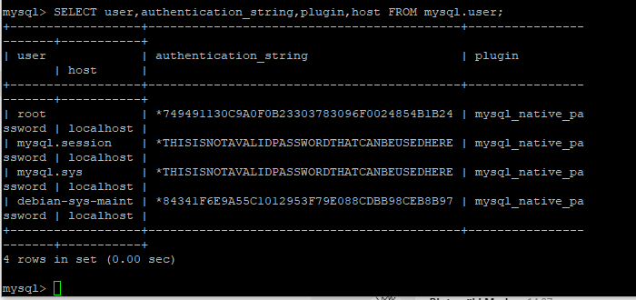

WordPress CMS julkaisujärjestelmä ja WooCommerce lisäosa  
========================================================
Asennus Ubuntu 18.04 käyttöjärjestelmään
----------------------------------------
Sami Luoma-aho, N4939  
19.3.2020  
TTMS0800 Web-palvelun hallinta harjoitustyö  

[1. Johdanto](#1-johdanto)  
[2. Esivalmistelut](#2-esivalmistelut)  
- [2.1. LAMP](#21-lamp)  
- [2.2. PHP](#22-php)  
- [2.3. MariaDB](#23-mariadb)  

[3. WordPress CMS asennus](#3-wordpress-cms-asennus)  
[4. WooCommerce asennnus](#4-woocommerce-asennnus)  
[5. Johtopäätökset](#5-johtopäätökset)  

# 1. Johdanto  
Testausta  

# 2. Esivalmistelut
>\$ sudo apt update  
>\$ sudo apt upgrade  

## 2.1. Apache
>\$ sudo apt install apache2

Apachen asennuksen jälkeen asetetaan UFW-työkalulla palomuuriin sopivat asetukset Apachea varten. UFW:ssä on valmiiksi joitain profiileita eri sovelluksia varten. Valmiit profiilit voi listata komennolla: 
>\$ sudo ufw app list

>*Available applications:
&nbsp;&nbsp;&nbsp; Apache  
&nbsp;&nbsp;&nbsp; Apache Full
&nbsp;&nbsp;&nbsp; Apache Secure
&nbsp;&nbsp;&nbsp; OpenSSH*

Komennolla
>\$ sudo ufw app info "Apache Full"  

nähdään ufw:n valmiin profiilin tiedot. Tiedoista käy ilmi, että ufw:n palomuuriin sallitaan TCP-liikenne portteihin 80 ja 443. Portit ovat http ja ssh -protokollien käyttämät portit.  

Lisätään palomuuriin profiili Apache Full.  
>\$ sudo ufw allow in "Apache Full"

Seuraavaksi käynnistetään apache2 palvelu uudelleen komennolla:
>\$ systemctl restart apache2

Ja tarkistetaan, että palvelu on käynnissä komennolla
>\$ systemctl status apache2

Palvelun tilan tulisi olla "active (running)"

## 2.2. MySQL

>\$ sudo apt install mysql-server

Seuraavaksi ajetaan MySQL:ään esiasennettu scripti, jolla asetetaan tiettyjä turvaominaisuuksia tietokannalle. Ominaisuuksissa määritellään muun muassa 
- salasanan validointi, 
- anonymous käyttäjän poisto
- test database:n poisto
- root käyttäjän etäyhteyden esto
  
>\$ sudo mysql_secure_installation

Edellä mainittu tietoturvaominaisuuksien määrittely ei ole pakollinen, mutta lisää tietokannan tietoturvaa. 

Seuraavaksi asetetaan root käyttäjälle salasana MySQL:ään. Aloitetaan siirtymällä MySQL:ään. 

>\$ sudo mysql

Alla olevalla komennolla nähdään mikäli root käyttäjällä on olemassa salasana. Salasanaa ei ole mikäli sitä ei ole erikseen asetettu.

>mysql> SELECT user,authentication_string,plugin,host FROM mysql.user;

Asetetaan salasana ja asetetaan muutokset voimaan komennoilla:

>mysql> ALTER USER 'root'@'localhost' IDENTIFIED WITH mysql_native_password BY '  *your password*  ';

>mysql> FLUSH PRIVILEGES;

Halutessasi voit vielä tarkistaa, että salasana on asetettu.

## 2.3. PHP

# 3. WordPress CMS asennus

# 4. WooCommerce asennnus

# 5. Johtopäätökset

Harjoitustyön nimi, tekijöiden nimet, päivämäärä ja tieto siitä, että kyseessä on Verkkopalvelut -opintojakson harjoitustyö.
Tehtävän kuvaus / Johdanto. Esim. "Nykyiset Internetin sovellusprotollat ovat hyvin turvattomia... varsinkin e- kaupankäynnissä on välttämätöntä salata http-liikennettä... https-"protokolla" on ratkaisu; Se... ... Tässä työssä asennetaan Linux alustalle SSL-kykyinen Apache Web-palvelin"
Varsinainen aiheen käsittely. Esim. ohjelmistot käyttöesimerkkeineen
mahdollisesti asennusohjeita (Mistä URLista imuroitiin ja mitä jne..)
mahdollisesti käyttöohjeita ja käyttöesimerkkejä mahdollisine kuvaruutukauppauksineen
Johtopäätökset: "Ohjelma sopii hyvin... Vaikea asennus on Linuxiin tottumattomalle..."
Lähteet