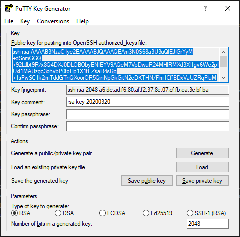
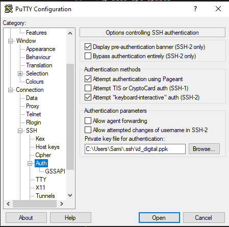
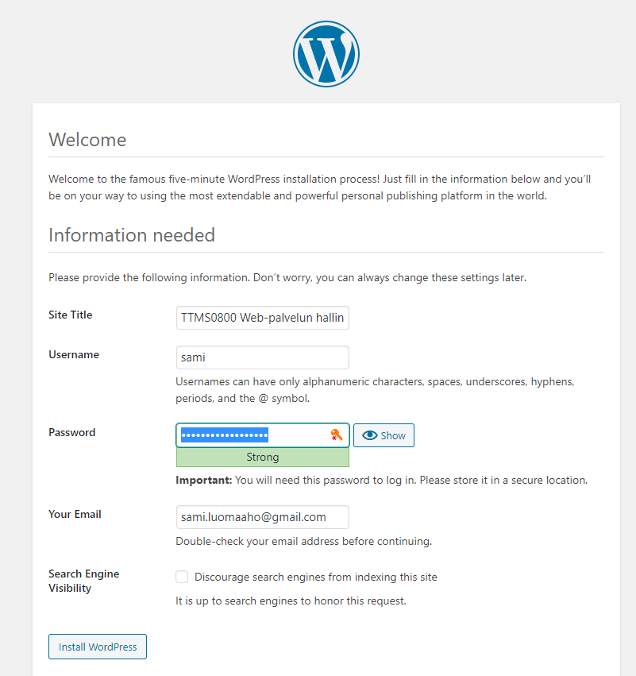
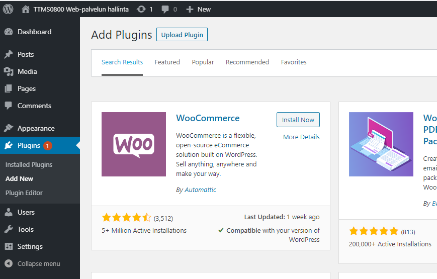
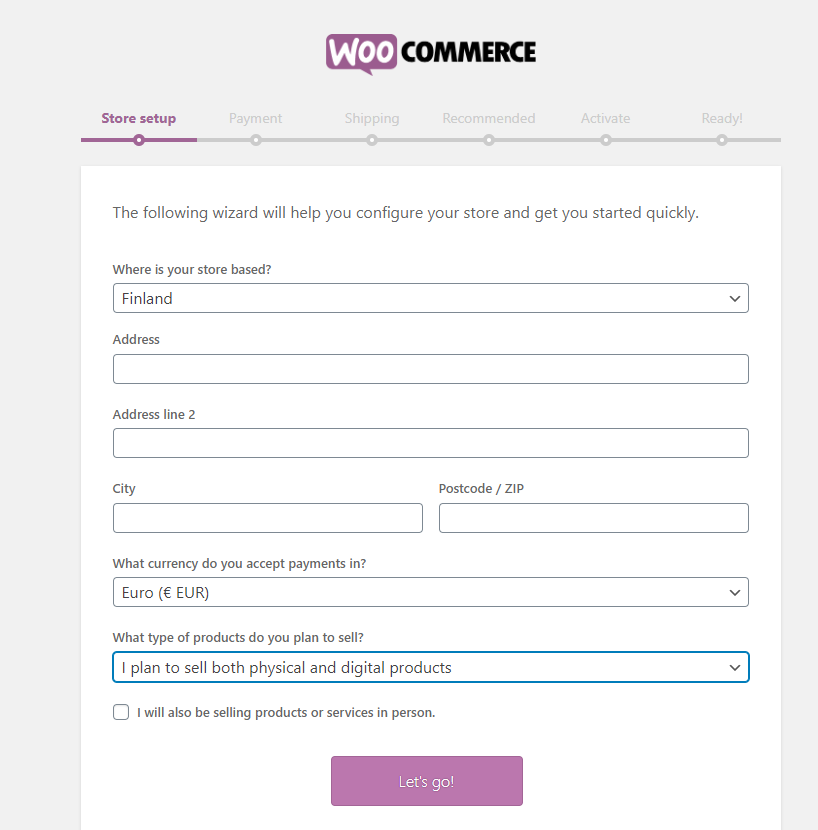
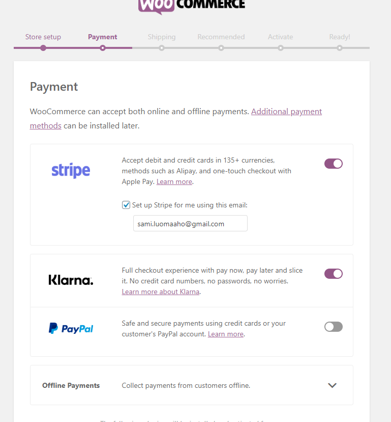
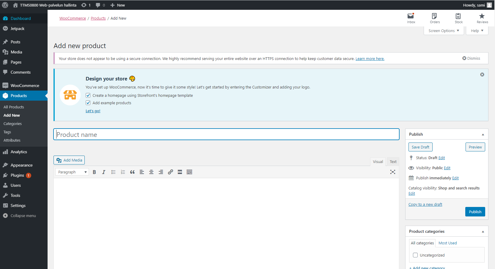

WordPress CMS julkaisujärjestelmä ja WooCommerce lisäosa  
========================================================
Asennus Ubuntu 18.04 käyttöjärjestelmään
----------------------------------------
Sami Luoma-aho, N4939  
19.3.2020  
TTMS0800 Web-palvelun hallinta harjoitustyö  

  
**SISÄLLYS**  
[1. Johdanto](#1-johdanto)  
[2. Esivalmistelut](#2-esivalmistelut)  
- [2.1. SSH-avaimen asettaminen](#21-ssh-avaimen-asettaminen)  
- [2.2. Apache](#22-apache)  
- [2.3. MySQL](#23-mysql)  
- [2.4. PHP](#24-php)  
- [2.5. Apachen lisäasetuksia](#25-apachen-lisäasetuksia)  

[3. WordPress CMS asennus](#3-wordpress-cms-asennus)  
- [3.1. Käyttöoikeuksien säätäminen](#31-käyttöoikeuksien-säätäminen)  
- [3.2. wp-config.php](#32-wp-configphp)  
- [3.3. WordPress asennuksen viimeistely](#33-wordpress-asennuksen-viimeistely)  

[4. WooCommerce asennnus](#4-woocommerce-asennnus)  
[5. Johtopäätökset](#5-johtopäätökset)  
[6. Lähteet](#6-lähteet)  

# 1. Johdanto  
WordPress on avoimen lähdekoodin julkaisualusta, jota käytetään erittäin laajasti myös verkkokauppojen alustana muun muassa WooCommerce lisäosan kanssa. Erään [lähteen](https://hostingtribunal.com/blog/wordpress-statistics/#gref) mukaan, WordPress toimii noin 35%:ssa internetsivustoja ja CMS (content mnagement system) ohjelmistoja hyödyntävistä sivuista jopa 60% on WordPressillä toteutettuja. Saman lähteen mukaan 28% kaikesta verkkokaupasta tehdään WooCommerce lisäosalla ja 281 uutta WooCommerce kauppaa avautuu joka päivä. Vaikka lukujen tarkkuutta voi olla vaikea todentaa, selvää on, että WordPress on erittäin merkittävä CMS alusta ja toisaalta WooCommerce erittäin merkittävä kauppapaikkasovellus.  

Harjoitustyössä luodaan täysin toimiva WordPress CMS alusta WooCommerce -kauppapaikkalaajennoksella Ubuntu 18.04 server käyttöjärjestelmään. Harjoitustyö tehdään Digital Ocean droplettiin, joka toimii harjoitustyön ajan osoitteessa 134.122.85.70. Etäyhteyden ottamiseen työssä käytetään Putty SSH-etäohjelmaa ja SSH-avainparin luomiseen puttygen -ohjelmistoa. Molemmat ohjelmistot on saatavissa Windows käyttöjärjestelmään.  

# 2. Esivalmistelut

Luodaan aluksi uusi käyttäjä, jolle annetaan sudo oikeudet.  
>\$ sudo useradd -m -s /bin/bash *your_user*  
>\$ usermod -aG sudo *your_user*  

Lisäksi asetetaan uudelle käyttäjälle salasana, jonka jälkeen siirrytään käyttämään luotua käyttäjää. Tästä eteenpäin kaikki komennot tehdään luodulla käyttäjällä.  
>\$ passwd *your_user*  
>\$ su *your_user*  

Aivan aluksi päivitetään aptitude kirjasto ja järjestelmä. Tällöin käytämme asennuksissa varmasti viimeisimpiä ohjelmistoja.  
>\$ sudo apt update  
>\$ sudo apt upgrade  

## 2.1. SSH-avaimen asettaminen 

Myöhempää ylläpitoa ja tietoturvaa parantaaksemme, asennetaan serverille ssh-avain, jolla jatkossa salasanan sijaan tunnistaudumme serverille. Kytketään myös salasanalla kirjautuminen kokonaan pois päältä.  

Aluksi luodaan rsa-avainpari esimerkiksi Windowsiin saatavilla olevalla puttygen -ohjelmalla (kuva alla), jonka jälkeen kopioidaan avainparin julkinen osa serverille. Yksityinen avain tallennetaan omalle koneelle. Tässä luomme avaimen juuri luodulle käyttäjälle.   

  

Ensiksi luodaan tarvittava kansio, jonne julkinen avain sijoitetaan. Tämän jälkeen luodaan tiedosto, jonne julkinen avain kopioidaan.  

>\$ mkdir ~/.ssh  
>\$ nano ~/.ssh/authorized_keys  

Authorized_keys tiedostoon lisätään puttygen-ohjelmalla luotu julkinen avainpari **yhdelle riville**. Rivi alkaa sanoilla "ssh-rsa", jonka jälkeen tulee välilyönti. Muita välilyöntejä ei saa olla. Tallennetaan tiedosto.  

Lopuksi asetataan vielä oikeudet kuntoon ja käynnistetään ssh-palvelu uudelleen:  

>\$ chmod 700 ~/.ssh  
>\$ chmod 600 ~/.ssh/authorized_keys  
>\$ sudo systemctl restart ssh.service  

Kun seuraavan kerran otetaan yhteyttä esimerkiksi Putty-ohjelmalla tulee avainparin yksityinen osa lisätä luotavan yhteyden konfiguraatiotietoihin.  

  

Tämän jälkeen luodun käyttäjän tunnuksella serverille kirjautuessa ei tarvita enää salasanaa.  

>\$ sudo nano /etc/ssh/sshd_config  

Muokataan alla olevat rivit esitetyiksi sshd_confgi -tiedostosta. Muokkauksilla estetään root-käyttäjän kirjautuminen serverille ja estetään salasanalla kirjautuminen. **Huomaa, että ennen muutoksia on hyvä kuitenkin testata, että ssh-avaimella kirjautuminen onnistuu.** Muutoksen jälkeen avaimia ei serverille enää helposti saa. Tämä osio ei myöskään ole mitenkään pakollinen WordPressin toiminnan kannalta.  

>ChallengeResponseAuthentication no  
PermitRootLogin no  
PasswordAuthentication no  
UsePAM no  
  
## 2.2. Apache
>\$ sudo apt install apache2  

Apachen asennuksen jälkeen asetetaan UFW-työkalulla palomuuriin sopivat asetukset Apachea varten. UFW:ssä on valmiiksi joitain profiileita eri sovelluksia varten. Valmiit profiilit voi listata komennolla:  
>\$ sudo ufw app list  

>*Available applications:  
&nbsp;&nbsp;&nbsp; Apache  
&nbsp;&nbsp;&nbsp; Apache Full  
&nbsp;&nbsp;&nbsp; Apache Secure  
&nbsp;&nbsp;&nbsp; OpenSSH*  

Komennolla
>\$ sudo ufw app info "Apache Full"  

nähdään ufw:n valmiin profiilin tiedot. Tiedoista käy ilmi, että ufw:n palomuuriin sallitaan TCP-liikenne portteihin 80 ja 443. Portit ovat http ja ssh -protokollien käyttämät portit.  

Lisätään palomuuriin profiili Apache Full.  
>\$ sudo ufw allow in "Apache Full"  

SSH-yhteyttä varten lisätään palomuuriin sääntö sallia ssh-yhteys.  
>\$ sudo ufw allow ssh  

SSH-yhteys voidaan sallia myös tietystä ip-osoitteesta. Tällöin tulee kuitenkin huolehtia siitä, ettei oma ip-osoite muutu.  

>\$ sudo ufw allow ssh from *oma_ip-osoitteesi*  

Lopuksi asetetaan palomuuri toimintaan.  

>\$ sudo ufw enable  

Seuraavaksi käynnistetään apache2 palvelu uudelleen ja tarkistetaan, että palvelu on käynnissä.  
>\$ systemctl restart apache2  
>\$ systemctl status apache2  

Palvelun tilan tulisi olla "active (running)".  

## 2.3. MySQL

>\$ sudo apt install mysql-server  

Seuraavaksi ajetaan MySQL:ään esiasennettu scripti, jolla asetetaan tiettyjä turvaominaisuuksia tietokannalle. Ominaisuuksissa määritellään muun muassa  
- salasanan validointi,  
- anonymous käyttäjän poisto  
- test database:n poisto  
- root käyttäjän etäyhteyden esto  
  
>\$ sudo mysql_secure_installation  

Edellä mainittu tietoturvaominaisuuksien määrittely ei ole pakollinen, mutta lisää tietokannan tietoturvaa.  

Seuraavaksi asetetaan root käyttäjälle salasana MySQL:ään. Aloitetaan siirtymällä MySQL:ään.  

>\$ sudo mysql  

Alla olevalla komennolla nähdään, mikäli root käyttäjällä on jo salasana. Salasana ei näy selväkielisessä muodossa vaan merkkijonona kohdassa "authentication_string". Mikäli kohta on root-käyttäjän kohdalla tyhjä, salasanaa ei ole asetettu.  

>mysql> SELECT user,authentication_string,plugin,host FROM mysql.user;  

Asetetaan salasana ja asetetaan muutokset voimaan komennoilla:  

>mysql> ALTER USER 'root'@'localhost' IDENTIFIED WITH mysql_native_password BY '  *your password*  ';  

>mysql> FLUSH PRIVILEGES;  

Halutessasi voit vielä tarkistaa, että salasana on asetettu.  

WordPress tarvitsee toimiakseen oman tietokannan. Tietokannan nimellä ei ole merkitystä, mutta käytämme tässä tietokannalla nimeä "wordpress". Luodaan tietokanta Wordpressin käyttöön komennolla:  

>mysql> CREATE DATABASE wordpress DEFAULT CHARACTER SET utf8 COLLATE utf8_unicode_ci;  

Tietokannan luonnin jälkeen luodaan erillinen MySQL-käyttäjä, jolla on oikeudet käyttää luotua tietokantaa. Jälleen käyttäjänimi voi olla mikä tahansa, mutta käytämme tässä nimeä "wordpressuser". Komennon jälkeen asetetaan muutokset voimaan ja poistutaan mysql:stä.  

>mysql> GRANT ALL ON wordpress.* TO 'wordpressuser'@'localhost' IDENTIFIED BY '  *your password*   ';  

>mysql> FLUSH PRIVILEGES;  

>mysql> EXIT;  

## 2.4. PHP

WordPress tarvitsee toimiakseen myös PHP:n ja joitain PHP laajennuksia. Asennetaan aluksi php sekä kaksi "apupakettia", jotta php voi keskutella apachen ja mysql:n kanssa.  

>\$ sudo apt install php libapache2-mod-php php-mysql  

Seuraavaksi asennetaan muutamia yleisimpiä PHP-laajennuksia Wordpressin käyttöön. Asennuksen jälkeen käynnistetään Apache uudelleen seuraavaa vaihetta varten.  

>\$ sudo apt install php-curl php-gd php-mbstring php-xml php-xmlrpc php-soap php-intl php-zip  

>\$ sudo systemctl restart apache2  

Ennen seuraavan vaiheeseen siirtymistä kannattaa tarkistaa, että php on asentunut. Tehdään testisivu tätä varten.
>\$ sudo nano /var/www/html/info.php  

Sisällöksi sivulle annetaan seuraavat rivit:  
> \<?php  
phpinfo();  
?>  

Mikäli PHP on asentunut oikein, nähdään alla oleva kuva selaimella osoitteessa:
>http://oma.ip-osoitteesi/info.php

## 2.5. Apachen lisäasetuksia
WordPress ja useat sen lisäosat käyttävät .htaccess tiedostoja kansiokohtaisiin muokkauksiin. Tämän vuoksi .htaccess tiedostojen käyttö (.htaccess override and rewrite) tulee sallia.  

Seuraavassa teemme muokkaukset sillä oletuksella, että Wordpressin juurikansio on /var/www/wordpress/.  

Luodaan wordpress.conf konfigurointitiedosto.

>\$ sudo nano /etc/apache2/sites-available/wordpress.conf  

Asetetaan tiedostoon sisällöksi alla olevat rivit:  

>\<Directory /var/www/wordpress/>  
>&nbsp;&nbsp;&nbsp;&nbsp;&nbsp;&nbsp; AllowOverride All  
>\</Directory>  

Astetaan verkkosivujen juurikansioksi /var/www/wordpress/ muokkaamalla tiedostoa /etc/apache2/sites-available/000-default.conf  

>\$ sudo nano /etc/apache2/sites-available/000-default.conf  

Muokataan tiedostossa DocumentRoot rivi muotoon:  
> DocumentRoot /var/www/wordpress/  

WordPressissä on ns. permalink -ominaisuus, jolla esimerkiksi blogipostauksiin voidaan viitata muuttumattomilla linkeillä. Permalink ominaisuuden mahdollistamiseksi Rewrite -moduli voidaan aktivoida komennolla:  

>\$ sudo a2enmod rewrite  

Lopuksi testataan, että kaikki toimii syntaksin puolesta.    

>\$ sudo apache2ctl configtest  

Komennon tuloksena saattaa tulla virhe, mutta lopuksi kuitenkin tulisi tulostua "Syntax OK". Mikäli näin on jatketaan käynnistämällä apache -palvelu uudelleen.  

>\$ sudo systemctl restart apache2  

# 3. WordPress CMS asennus

Aluksi luodaan väliaikainen kansio juureen. Ja haetaan wordpress.org osoitteesta viimeisin Wordpress versio.  
>\$ cd /tmp  
>\$ curl -O https://wordpress.org/latest.tar.gz  

Puretaan haettu tiedosto ja luodaan ns dummy .htaccess tiedosto wordpressin myöhempää käyttöä varten.  

>\$ tar xzvf latest.tar.gz  
>\$ touch /tmp/wordpress/.htaccess  

Haetun paketin mukana tulee myös esimerkki-konfiguraatiotiedosto, joka voidaan ottaa pohjaksi konfiguraatioillemme. Kopioidaan tiedosto nimelle, jota Wordpress lukee.  

>\$ cp /tmp/wordpress/wp-config-sample.php /tmp/wordpress/wp-config.php  

WordPress käyttää upgrade kansiota tehdessään ohjelmistopäivityksiä. Luodaan kansio valmiiksi, jotta ehkäistään mahdolliset käyttöoikeusongelmat, kun WordPress yrittää luoda kansiota.  

>\$ mkdir /tmp/wordpress/wp-content/upgrade  

Lopuksi kopioidaan kaikki tiedostot oikeaan kansioon.  

>\$ sudo cp -a /tmp/wordpress/. /var/www/wordpress  

## 3.1. Käyttöoikeuksien säätäminen

Wordpressin toiminnan kannalta ja toisaalta riittävän tietoturvan kannalta on olennaista säätää tiedostojen ja kansioiden omistus ja oikeudet oikein.  
Apache webserver toimii www-data käyttäjänä. Jotta Apache voisi kirjoittaa ja lukea WordPressin tiedostoja, täytyy sille antaa riittävät oikeudet. Asetetaan wordpress-kansio www-data käyttäjän omistukseen chown-komennolla.  

>\$ sudo chown -R www-data:www-data /var/www/wordpress  

Seuraavilla kahdella find-komennolla annetaan wordpress-kansiossa oleville kansioille oikeudet 750 ja tiedostoille 640.  

>\$ sudo find /var/www/wordpress/ -type d -exec chmod 750 {} \;  
>\$ sudo find /var/www/wordpress/ -type f -exec chmod 640 {} \;  

## 3.2. wp-config.php

Wordpress -kansiossa oleva tiedosto wp-config.php on Wordpressin konfiguraatio-tiedosto. WP-config.php sisältää muun muassa sisäisesti käytettävät yksilölliset "turva-avaimet" (Wordpress security keys). Avaimet varmistavat mm. paremman salauksen käyttäjien evästeisiin tallennetteuihin tietoihin.  

Wordpressiltä on saatavissa suoraan sarja satunnaisia avaimia oikeassa muodossa. Avaimet voi hakea komennolla:  

>\$ curl -s https://api.wordpress.org/secret-key/1.1/salt/  

Seuraavaksi haetut avaimet täytyy kopioida oikeaan kohtaan wp-config.php -tiedostossa. Avataan tiedosto editointia varten.  

>\$ sudo nano /var/www/wordpress/wp-config.php  

Alla olevan kuvan mukaiset rivit korvataan WordPressiltä haetuille avaimilla.   

  

Seuraavaksi muokataan samassa tiedostossa alla olevia rivejä, jotka liittyvät MySQL:ään. Riveille annetaan Wordpressin käyttöön luomamme MySQL - tietokannan nimi, käyttäjän nimi ja käyttäjän salasana.   

  

Lopuksi on tärkeää asettaa wp-config.php -tiedostolle tiukemmat oikeudet kuin muille tiedostoille.

>\$ sudo chmod 400 /var/www/wordpress/wp-cpnfig.php  

## 3.3. WordPress asennuksen viimeistely

WordPressin asennuksen viimeistely tehdään siirtymällä selaimella serverin osoitteeseen http://oma-ip-osoite.  

Ensimmäisenä valitaan käytettävä kieli, jonka jälkeen annetaan sivustolle nimi ja valitaan käyttäjänimi sekä annetaan salasana ja oma sähköpostiosoite. Lopuksi painetaan asennuspainiketta.  

Asennuksen jälkeen olet valmiina kirjautumaan sisään WordPressiin.  

# 4. WooCommerce asennnus

WooCommerce on avoimen lähdekoodin verkkokauppa-alusta käytettäväksi WordPressissä. Verkkokauppa on verrattain helppo ja nopea pystyttää ja verkossa on saatavilla runsaasti ohjeita ja lisäosia muun muassa maksutapoihin myös suomalaisille käyttäjille.  

WooCommercen asennus tapahtuu WordPressin hallintapaneelista kohdasta plugins / add new. Hakusanalla woocommerce löytyy oikea lisäosa.  

Ensimmäisenä täytetään verkkokaupan perustiedot.  

Seuraavaksi voidaan valita jo pari eri maksutapaa. Mikäli valintoja ei tee tässä vaiheessa on lisäosat mahdollista asentaa myös myöhemmin. Saatavana on paljon myös muita lisäosia maksamiseen liittyen. Maksamiseen liittyvät lisäosat tarvitsevat luonnollisesti oman sopimuksen tai käyttäjätilin itse palveluntarjoajan kanssa.  

Alkuvalintojen jälkeen voidaan vaikkapa aloittaa tuotteiden lisäys verkkokauppaan!  

# 5. Johtopäätökset

WordPressin asentamiselle on olemassa "yksinkertaisempikin" tapa graafisia käyttöliittymiä käyttäen tai jopa ohjelmistoja, jotka asentavat WordPressin automaattisesti. Tyypillisesti hosting-yritykset tarjoavat automaattista WordPressin asennusta. Automaattisiin ohjelmistoihin en ole tutustunut, mutta verrattuna asennukseen graafisia käyttöliittymiä käyttäen, suoraan konsolilta asenuksessa on etuja erityisesti tietoturvan näkökulmasta. Toki GUI:llakin tietoturvan saa varmasti kuntoon, muttei ilman tiedostojen muokkausta siinäkään.  

Loppujen lopuksi WordPressin asennus omalle Ubuntu-serverille konsolilla ei ole kovin monimutkaista. Toisaalta asennuksen voi helposti tehdä hyvin turvattomasti, jonka jälkeen on enää tuurista kiinni murtautuuko joku sivustolle. Perustietoturva vaatii hieman viitseliäisyyttä ja lopullinen tietoturvan taso tietenkin kiinni WordPress -sivuston tärkeydestä ja siinä liikkuvan rahan määrästä. Hieman tärkeämpien sivustojen kohdalla lähtisin itse rakentamaan WordPress sivustoa CentOs server -käyttöjärjestelmälle.  

# 6. Lähteet

[WordPressin asennus](https://www.digitalocean.com/community/tutorials/how-to-install-wordpress-with-lamp-on-ubuntu-18-04)  

[LAMP Stack asennus](https://www.digitalocean.com/community/tutorials/how-to-install-linux-apache-mysql-php-lamp-stack-ubuntu-18-04)  

[WordPress Security Keys](https://www.wpwhitesecurity.com/wordpress-security-keys/)  

[WordPress, why and how Security Keys](https://www.wpbeginner.com/beginners-guide/what-why-and-hows-of-wordpress-security-keys/)  

[WordPress Permalinks](https://wordpress.org/support/article/using-permalinks/)  

[WordPress with LAMP on Ubuntu](https://www.tecmint.com/install-wordpress-on-ubuntu-16-04-with-lamp/)  

[WordPress and WooCommerce with LAMP](https://websiteforstudents.com/install-wordpress-woocommerce-with-apache2-mariadb-and-php-7-2-on-ubuntu-16-04-17-10-18-04/)  

